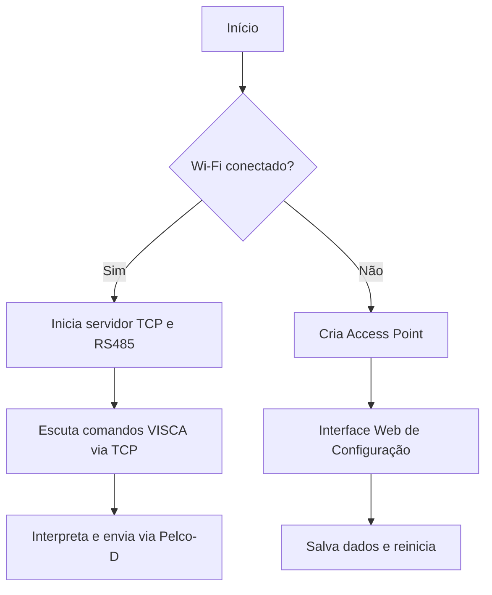

# Controle de Câmera com ESP32 + Pelco-D + VISCA

Este projeto permite controlar uma câmera via protocolo **Pelco-D** com comandos **VISCA** usando um **ESP32**, com suporte a:

- Conexão Wi-Fi com fallback para Access Point (modo configuração)
- Interface web para configuração de SSID, senha, IP fixo e endereço da câmera
- Servidor TCP para receber comandos VISCA (porta 2000)
- Transmissão de comandos via RS485 (SoftwareSerial)
- Atualização de firmware OTA (Over The Air)

---

## Arquitetura do Projeto

| Arquivo               | Função                                                                 |
|-----------------------|------------------------------------------------------------------------|
| `main.ino`            | Fluxo principal: conexão, leitura TCP, interpretação e envio de comandos |
| `WiFiConfig.h`        | Configuração de rede (STA ou AP), interface web, armazenamento          |
| `OTASetup.h`          | Inicializa e gerencia atualização OTA via rede Wi-Fi                     |
| `pelco_command.h`     | Controle da câmera via protocolo Pelco-D em RS485                        |
| `command.h`           | Interpreta comandos VISCA recebidos do cliente TCP                      |

---

## Como funciona

### 1. Conexão Wi-Fi
- Tenta conectar à última rede Wi-Fi salva
- Se falhar, cria um Access Point: `CAMERA_SETUP`, senha: `12345678`
- Interface acessível em: `http://192.168.4.1`

### 2. Interface Web (modo AP)
Permite configurar:
- SSID e senha do Wi-Fi
- IP fixo, gateway e subnet (opcional)
- Endereço da câmera (1 a 255)

Essas informações são salvas na flash usando `Preferences` e usadas no próximo boot.

### 3. Comandos TCP
- O ESP32 escuta na porta **2000**
- Lê os bytes do cliente até encontrar `0xFF` (fim do comando VISCA)
- Interpreta o comando via `command.h`
- Converte para comando Pelco-D e envia via RS485

### 4. RS485
- Utiliza `SoftwareSerial` nos pinos **16 (RX)** e **17 (TX)**
- Usa o pino **D5** para controle de direção (RE/DE)
- Envia comandos no protocolo Pelco-D baseados nos comandos VISCA recebidos

### 5. OTA
- Ao conectar com sucesso na rede Wi-Fi, o ESP32 aceita atualização OTA via IDE (Arduino ou PlatformIO)
- Nome da rede: `camera-controller.local`
- Senha OTA: `123456`

---

## OTA via PlatformIO

### 1. Certifique-se de que:
- O firmware atual já possui `setupOTA()` e `handleOTA()`
- O ESP32 está conectado na **mesma rede Wi-Fi** que seu computador
- Você conhece o **IP do ESP** ou ele responde como `camera-controller.local`

### 2. Atualize seu `platformio.ini` com:

```ini
[env:esp32-ota]
platform = espressif32
board = esp32dev
framework = arduino
upload_protocol = espota
upload_port = camera-controller.local  ; ou 10.0.0.45
upload_flags =
  --auth=123456
  --port=3232
```

### 3. Use via terminal:
```bash
pio run -t upload -e esp32-ota
```

Ou selecione o ambiente `esp32-ota` na interface do PlatformIO e clique em Upload.

---

## Fluxo resumido


---

## Pinos utilizados no ESP32

| Função        | Pino  |
|----------------|--------|
| RS485 TX       | 17     |
| RS485 RX       | 16     |
| RS485 RE/DE    | 5      |
| LED status     | 2      |

---

## Como atualizar via OTA
1. O ESP32 deve estar conectado à mesma rede Wi-Fi que o seu computador
2. Na IDE (Arduino ou PlatformIO), selecione o dispositivo: `camera-controller.local`
3. Compile e envie normalmente (OTA)

---

## Futuras melhorias sugeridas
- [ ] Botão físico para reset das configurações
- [ ] Rota `/status` com dados atuais (IP, SSID, endereço da câmera)
- [ ] Interface protegida por login
- [ ] Lista de redes Wi-Fi disponíveis na página web
- [ ] Upload OTA via navegador (interface web)

---

> Desenvolvido por Pedro Henrique

