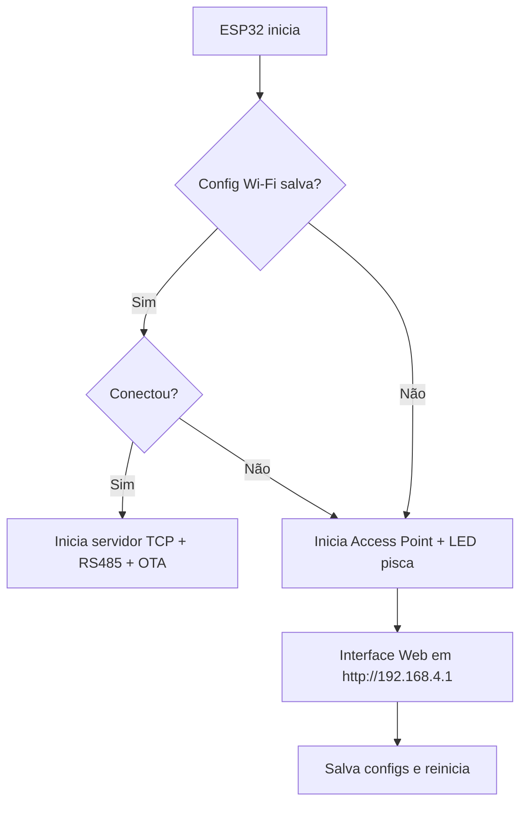

# 📷 Projeto: Controle de Câmera com ESP32 — Pelco-D + VISCA

Este projeto transforma o ESP32 em um **controlador inteligente para câmeras PTZ (Pan-Tilt-Zoom)** que utilizam protocolo **Pelco-D**, recebendo comandos em **VISCA** via TCP/IP.

👉 Ideal para aplicações em **videomonitoramento**, **estúdios**, **salas de controle**, ou **projetos DIY de automação de câmera**.

---

## 🧠 Visão Geral

🔹 O ESP32 atua como **gateway entre comandos VISCA (via rede)** e **comandos Pelco-D (via RS485)**.  
🔹 Conta com **interface web para configuração de rede e parâmetros da câmera**.  
🔹 Possui **modo AP automático**, OTA, reset físico e LED indicador de status.

---

## 🚀 Funcionalidades Principais

### 📡 1. **Conexão Wi-Fi Inteligente**
- O ESP32 tenta conectar à rede Wi-Fi salva (modo **STA**).
- Se falhar, **ativa automaticamente um Access Point** chamado `CAMERA_SETUP` para configuração.

### 🌐 2. **Interface Web Completa** (modo AP)
Acesse via `http://192.168.4.1` e configure:
- ✅ SSID e senha do Wi-Fi
- ✅ IP fixo, gateway e subnet (opcional)
- ✅ Endereço da câmera (byte entre 1 e 255)
- ✅ Porta TCP para recebimento dos comandos

Todas as informações são salvas de forma persistente com `Preferences` na flash do ESP32.

### 🎯 3. **Recebimento de Comandos VISCA por TCP**
- Porta TCP configurável (padrão: **2000**) escutando comandos em formato VISCA
- Ao receber um comando, ele é interpretado e convertido para Pelco-D

### ↔️ 4. **Envio de Comandos Pelco-D via RS485**
- Usa `SoftwareSerial` nos pinos 16 (RX2) e 17 (TX2)
- Controle de direção com pino D5 (RE/DE)
- Comandos possíveis:
  - Movimento: cima, baixo, esquerda, direita
  - Zoom in / Zoom out
  - Set, call e clear de presets

### ⛈️ 5. **Atualização OTA (Over-the-Air)**
- Quando conectado à rede, o ESP aceita **upload de firmware via Wi-Fi**
- Funciona com PlatformIO ou Arduino IDE
- Nome do dispositivo: `camera-controller-{DEVICE_ID}.local`
- Senha OTA: `123456`

### ⏺️ 6. **Botão de Reset (GPIO0 / BOOT)**
- Se mantido pressionado por 3 segundos durante o boot:
  - 🪩 Apaga todas as configurações salvas (Wi-Fi, IP, câmera)
  - ⟳ Reinicia automaticamente no modo AP

### 💡 7. **LED Indicador de Status (GPIO2)**
- Enquanto o ESP estiver em modo Access Point:
  - O LED pisca a cada 500ms
  - Informa que o ESP está aguardando configuração

---

## 🔌 Diagrama de Conexão — ESP32 ↔ RS485

```
📄 ESP32 GPIOs         ↔       Módulo RS485 (ex: MAX485)
----------------------------------------------------------
GPIO16 (RX2)         →       RO (Receiver Output)
GPIO17 (TX2)         ←       DI (Driver Input)
GPIO5  (D5)          →       RE/DE (Control)
```

---

## 📂 Estrutura dos Arquivos

| Arquivo               | Função                                                                 |
|-----------------------|------------------------------------------------------------------------|
| `main.cpp`            | Loop principal, conexões, entrada de comandos                          |
| `WiFiConfig.h`        | Gerencia STA/AP, interface web, preferences e LED                      |
| `pelco_command.h`     | Geração e envio de comandos Pelco-D via RS485                          |
| `command.h`           | Interpretação de comandos VISCA e conversão para comandos internos     |
| `OTASetup.h`          | Setup OTA usando `ArduinoOTA`                                          |
| `mqttAws.h`           | Integração com AWS IoT via MQTT                                        |
| `logUtil.h`           | Utilitários para logs locais e MQTT                                    |
| `blynkSetup.h`        | (opcional) Integração com Blynk IoT                                    |
| `config.h`            | Variáveis globais e defaults como DEVICE_ID, porta padrão etc.         |

---

## 🧰 Pinos Utilizados no ESP32

| Função                   | Pino  |
|--------------------------|--------|
| RS485 TX                 | 17     |
| RS485 RX                 | 16     |
| RS485 RE/DE              | 5      |
| LED indicador (modo AP)  | 2      |
| Botão BOOT (reset cfg)   | 0      |
| Botão EN (reset chip)    | EN     |

---

## 🧪 Upload OTA com PlatformIO

### 📌 Requisitos:
- Firmware compilado com `setupOTA()` e `handleOTA()`
- ESP32 e seu PC conectados na mesma rede Wi-Fi

### ⚙️ Exemplo no `platformio.ini`:
```ini
[env:esp32-ota]
platform = espressif32
board = esp32dev
framework = arduino
upload_protocol = espota
upload_port = camera-controller-cam001.local
upload_flags =
  --auth=123456
  --port=3232
```

### 🔼 Enviando via terminal:
```bash
pio run -t upload -e esp32-ota
```

---

## ⟲ Fluxo do Projeto


---

## 📡 Diagrama do Fluxo de Conexão Wi-Fi

```mermaid
graph TD
START([Início]) --> CHECK_SSID{Configuração Wi-Fi existe?}
CHECK_SSID -- Não --> MODE_AP[Iniciar Access Point (CAMERA_SETUP)]
CHECK_SSID -- Sim --> TRY_CONNECT[Conectar à rede Wi-Fi configurada]
TRY_CONNECT -- Sucesso --> INIT_SERVER[Iniciar Servidor TCP e OTA]
TRY_CONNECT -- Falha --> MODE_AP
MODE_AP --> HOST_UI[Exibir página de configuração Wi-Fi (192.168.4.1)]
HOST_UI --> SAVE_CONFIG[Salvar nova configuração e reiniciar]
```

---

## 🔒 Segurança
- Configurações salvas em flash via `Preferences`
- OTA protegido com senha `123456`
- Reset seguro via BOOT apenas no boot

---

## 🧱 Futuras Melhorias
- [ ] Upload OTA via interface web
- [ ] Proteção da interface com login
- [ ] Visualização de status da câmera e rede
- [ ] Listar redes Wi-Fi disponíveis na interface
- [ ] Interface SPIFFS com HTML/CSS customizado

---

## 👨‍💼 Autor
**Pedro Henrique**  
Desenvolvido com foco em **flexibilidade, conectividade e controle remoto de câmeras.**

---

🎉 **Obrigado por usar o projeto!**

